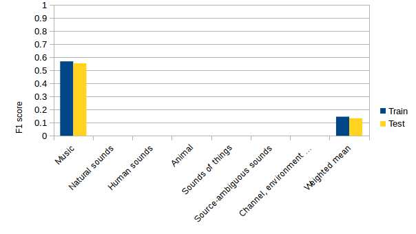
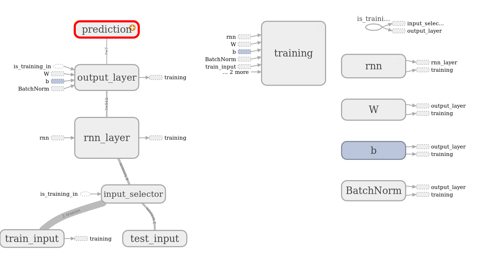
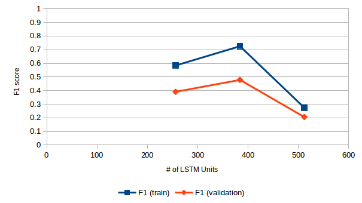
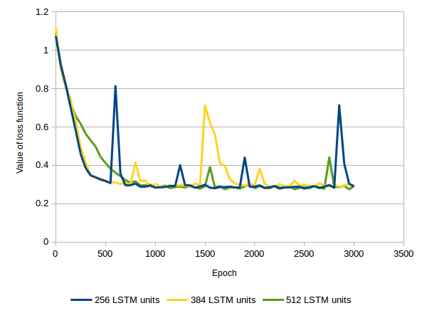
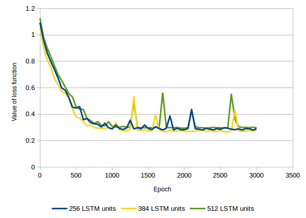
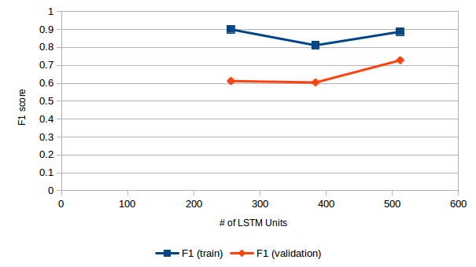
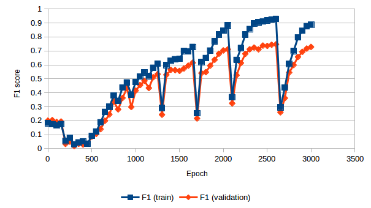
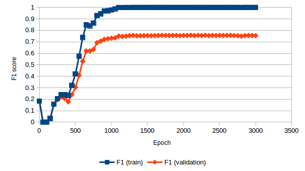
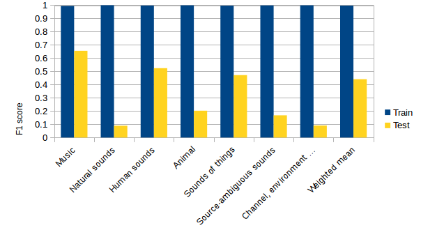
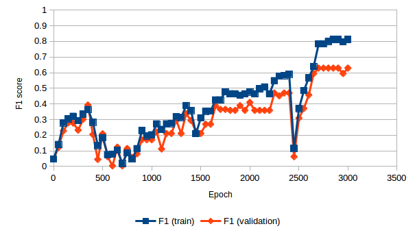

# Machine Learning Engineer Nanodegree
## Capstone Project
Jari-Pekka Ryynänen

August 6th, 2017

## I. Definition

### Project Overview

This capstone project is about categorizing audio samples. Categorizing audio samples is a process
of giving an appropriate label to audio. In this project we are using Google AudioSet [1], which
contains huge amount of labeled samples drawn from YouTube-videos. More precisely, we are using
balanced subsets of the AudioSet, which contain approximately 22k samples for training and 20k
samples for testing. Dataset is described in more detail in [1] and [2].

As the used dataset is rather big, the resulting model has good chance to generalize well also to
audio from other sources than YouTube. There are several application ideas for this kind of model:

 * categorizing audios/videos and making semantic search possible

 * displaying extra information with captions (very helpful for deaf people)

 * triggering some actions based on the audio event (like saving only speech)

### Problem Statement

Problem to solve: Create a system that is capable of giving (possible multiple) label(s) to a short
audio segment. More precisely, given audio sample, predict a label that describes that sample,
where label is from predefined set. The approach will be supervised, i.e. system is trained to do
this prediction by showing sample-label pairs. Precise predictions with coarse labels are preferred
over imprecise with detailed labels. Target labels will be the top-level labels in AudioSet ontology:
"Human sounds", "Source-ambiguous sounds", "Animal", "Sounds of things", "Music", "Natural sounds",
"Channel, environment and background".

This problem statement differs slightly from the one given in Capstone Proposal. In Proposal the
target was to give only single label. However, it became very quickly clear that since the audio segments
are multi-label by nature, trying to classify them with only single label was not an option. For example,
if one audio sample would have labels "Music" and "Animal", duplicating that sample to two samples with
those labels would lead to situation where one of the samples would inevitably be misclassified. Dropping one
label would also lead to problems. If label "Music" would be dropped from our example, and the classifier
would still after that predict the sample to have label "Music", we would declare it being wrong and
steer the training to other direction, even though the sample could be mostly "Music" (there is no knowledge
how "strongly" the given labels are in samples).

First task is to download and store samples. The samples are segments of YouTube videos, but as we
are interested in the audio of those videos, the audio must be extracted.

After the samples are stored locally, preprocessing can be done. Our preprocess-part will consist of
extraction of features, min-max-normalization of those features, label hot-encoding and padding
feature vectors to equal lengths.

Using output from the preprocess, zero-hypothesis, baseline and neural network models are fitted.
Model fit is evaluated against validation set, which is randomly drawn subset of training set. With
this split hyperparameters are tuned and models are re-evaluated until neural network does not seem
to improve with reasonable amount of work. For this part we might use smaller subset of the training
set to make the iterations faster.

When final model hyperparameters are found, full training set is used to train models,
and full testing set is used to get final scores.

### Metrics

Balanced error measure which is easy to understand, and is comparable with
values from [3] is F1-score: Harmonic mean of precision and recall.
Also precision will be used, to get comparable results with [2].
The equations for metrics are
\begin{equation}
f_1 = 2*precision*recall/(precision+recall)
\end{equation}
\begin{equation}
precision = tp/(tp+fp)
\end{equation}
\begin{equation}
recall = tp/(tp+fn)
\end{equation}
where *tp* is true positives, *fp* is false positives and *fn* is false negatives.
Since we are working with multi-label classification, these equations will be evaluated
for each class and we will average the scores using class weights most of the time.

\newpage

## II. Analysis

### Data Exploration

 

The class distribution of the top-level labels in the training dataset
is visualized in Figure 1. As we can see, there is slight imbalance between
classes. To compensate this, we will use weighted cost function, which emphasizes
the classes with less samples. Imbalanced class distribution indicates also that
we might want to use stratified sampling when subsampling data.

We have 21788 samples in the training dataset and 19979 in the testing dataset (these numbers do not match the
ones given in [1], since some of the videos are not available anymore).

In Figure 2. is an example of 10 second audio sample with top-level labels "Music" and "Human sounds".
Sample is from YouTube video "our STOMP routine - Ground Zero Master's Commission - Shout Out Loud!" [4]
between 30s - 40s. Same figure illustrates point-wise maximum, mean and minimum values calculated over
all training samples.

From Figure 2. we can see that there is no offset and for each point the whole numeric range is in use.

### Algorithms and Techniques

#### Benchmark models

In this project will be using two simple models whose performance will be compared against
our final model:

 * Zero-hypothesis: Model that predicts always the same (first) label.

 * Logistic regression: Linear model that "compresses" its output using logistic function to range [0, 1].
   For multi-label classification, multiple models are trained, each giving probability of one class.

These models will use the same features as the final model.

#### Mel-Frequency Cepstral Coefficients

Mel-Frequency Cepstral Coefficients (MFCC) are a way to present spectral information
of audio. They are usually calculated using short overlapping frames of audio.

Normal cepstral coefficients present the change in the spectrum; by picking the first few
cepstral coefficient we are able to capture the envelope of the spectrum. With MFCC, we
are also taking account how human auditory system works by dividing the spectrum using
Mel-scale, which approximates human hearing. [5]

Using MFCCs as features reduces the dimensionality of the problem compared to raw audio.
As they model the data similar manner as human hearing system, they should be able to capture 
relevant information that allows humans (and in this case, hopefully machines) to recognize
the audio samples.

#### Recurrent Neural Network

Recurrent Neural Networks (RNN) are neural networks that use their output from the previous time step
*t-1* when calculating output for the timestep *t*. Also the errors are propagated through timesteps backwards.
The chain rule that is used basically in all neural networks applies also here. [6]
 
Long Short-Term Memory (LSTM) units are building blocks for RNN that are able to learn over many time steps [7].
LSTM responds to vanishing/exploding gradient problems which may occur in long sequences by providing the
previous "internal state" of the unit as is to next timestep, and gating that state, input and output by 
"fuzzy" gates (i.e. if traditional logic gates can be seen as multiplication of 0 or 1, these gates multiply
using value which is from range [0, 1]).

By using RNN, we are able to capture temporal information of audio samples. With LSTM, our model can learn
dependencies which span over whole sequence, even if the sequence is long.

#### Batch normalization and weight initialization

Batch normalization is a neural network layer which helps relaxing tuning required for learning rate and adds regularization
to network [8]. It tries to normalize its input to have mean of 0 and variance of 1.

For weight initialization of neural network, orthogonal initializer is used. It has been reported to have
positive effect on controlling vanishing/exploding gradients [9].

#### Neural network multi-label output and label weights

Since the output for our model can have multiple labels, we will be using sigmoid activation in each output
node independently, and interpret the result as probability of corresponding class being present.
If the probability is over 1/2, our final prediction is that the class is present, and vice versa.

Label weights that are used to counter imbalanced distribution of classes are calculated using class frequencies
of the full training set.

### Benchmark

In [2] benchmark model is reported with "balanced mean Average Precision across
the 485 categories of 0.314". We are using more coarse labels, so we expect better result.

In [3] are results of audio scene classification with F1-score: "approach
obtains an F1-score of 97.7%". This result is however for single label classification,
so our score is likely to be worse.

Our zero-hypothesis and baseline model F1 scores are illustrated in Figure 3 and Figure 4.
Scores are calculated using full training dataset and full test dataset.

Precision test scores are 0.009 for zero-hypothesis and 0.405 for baseline model.

\newpage

## III. Methodology

### Data Preprocessing

 * Audio is extracted from videos and stored with sample rate 16 kHz.

 * 13 MFCC features are calculated with window length 0.1 seconds and overlap of 0.05 seconds.

 * Top-level labels for audio samples are gathered from the ontology tree and k-hot-encoded.

 * Each feature is min-max-normalized. This is done even batch normalization is used at parts of
   the model, as adding the batch normalization inside TensorFlow RNN did not seems easily doable.
 
 * Feature sequences are zero-padded to have equal lengths. Even though RNN is able to handle variable length
   sequences, the sequences used should have equal shapes and then the results are picked according to
   original lengths.

### Implementation

#### Getting the data

Downloading the balanced subsets of the AudioSet videos and extracting the audio from them was done using
modified version of download-script from "set of tools for downloading and using AudioSet" [10].
Following modifications were done to original script:

 * No gzip-compression (as further processing would be slower)

 * Change sample rate from 22050 Hz to 16000 Hz (to save some disk space)

 * Use only one channel (to save some disk space and make further processing simpler)

 * Prefix wav-files with "sample_" (some files were otherwise starting with dash, with caused problems)

Downloading all the samples took several days even with good quality Internet-connection. However for testing
purposes, download-script can be canceled e.g. after few hundred samples are ready.

#### Preprocessing

For preprocessing, numpy, pandas and library python_speech_features were used. Preprocess step is runnable as
separate Python-script, and creates single storage file with the preprocessed data. This file is fed to
script doing the model fitting and predictions.

#### Baseline models

Zero-hypothesis and logistic regression were implemented using scikit-learn. Logistic regression was wrapped
with one vs. many -ensemble classifier to create classifiers able to do multi-label classification.

#### RNN

RNN implementation was done with TensorFlow. The network graph is in Figure 5.

Providing input for graph using *feed_dict* -mechanism during training proved to be very slow.
Instead, whole training set was converted to tensor and fed to graph using *tf.train.batch*.
When testing the model, *feed_dict* was used for simplicity. Variable *is_training_in* was
used to indicate which input to use, and also to inform *BatchNorm* whether to update its
statistics.

### Refinement

Since the model training time was rather long with the whole training data (depending on the model complexity, up to several days)
parameter estimation was done with smaller subset of 1000 randomly drawn samples from training set, which was
furthermore divided to training and validation sets of 800 and 200 samples, respectively.

With this split, number of LSTM units were tuned, with pre-determined maximum of 512 (to control the training times of the model), while
measuring weighted mean F1 score.

In Figure 6 2000 epochs were used while training the model. As can be seen from the figure, model performance seems to first 
behave as expected and is rising as LSTM units are added, but with 512 units there is a drop in *both* training and validation performance.
Next in Figure 7 number of epochs is increased to 3000 to see if the model was simply not yet converged. However, the results are now significantly
worse with all measurement points. To understand better what is happening, loss functions are plotted in Figure 8. From there we can see that
they seem rather unstable.

Since we are using Adam optimization algorithm, the learning rate should be able to adapt by itself. However, the stability of
Adam optimization is relying on epsilon hyperparameter, which affects the numerical stability of the optimization, and is actually
marked in TensorFlow documentation to have questionable default value. [11] After epsilon is adjusted from its default value of 1e-8 to 1e-4,
spikes in loss functions are lowered (Figure 9) and the validation curve (Figure 10) shows that the validation score for 512 LSTM units is the best so far.

In Figures 11, 12 and 13 RNN model with 512 LSTM units is used with epsilon 1e-4. Split to training and validation sets is done using the
same 80% - 20% division as with 1000 samples. Interestingly, the instabilities seem to disappear as more data is used.
The selected model seems also to be powerful enough to fully learn the training data, having clear gap between
training and validation error, which *might* allow our model to generalize better when more data is added.

In Figure 13 the whole training dataset is in use. The result clearly outperforms our own baseline models, and the model
is decided to be good enough to be our final model. Also from Figure 13 we can see that the model has converged long before
epoch 3000, so we will drop our epoch count to 1500 when training model with whole training dataset without validation split.

{height=66%}

{height=66%}

\newpage

## IV. Results and conclusion

### Model Evaluation and Validation

Final results of the refined RNN model are illustrated in Figure 14 and Table 1. For these results,
whole training dataset is used for training, and the separate test dataset is used for testing.
In Table 1 are also benchmark results.

+-----------+-------+--------+-----------------+----------+-------+
|           | [2]   |   [3]  | Zero-hypothesis | Baseline | RNN   |
+===========+=======+========+=================+==========+=======+
| Precision | 0.314 |   N/A  | 0.093           | 0.405    | 0.521 |
+-----------+-------+--------+-----------------+----------+-------+
| F1        |  N/A  |  0.977 | 0.134           | 0.290    | 0.441 |
+-----------+-------+--------+-----------------+----------+-------+

Table: All test results. Scores are weighted means.

The results are much worse than expected. Based on the validation results, F1 score for
RNN was expected to be somewhere near 0.7. One explanation is that the model overfitted for training dataset, and
the validation dataset "leaked" to model through hyperparameter tuning, and gave overly optimistic results.

Also one problem with the RNN model seems the be that it takes several epochs to learn even the simplest dataset. Related to this,
the performance of the model seems to often drop quickly after the training is started, and start to rise only after some hundreds of epochs.
In Figure 15 only 100 samples are used, 80 for training and 20 for validation, but the model requires hundreds of epochs to learn anything,
and is not able to fully learn training set in 3000 epochs.

However, the model seems to perform better as more data is used. Also as the final model used here is tested with test dataset which is
approximately as big as the training dataset, the results are likely credible.

### Justification

From the Table 1 we can see that RNN model outperforms our own benchmark models. Compared to results from [2]
and [3] the outcome is in line with prediction made in subchapter Benchmark of chapter II.

From Figure 14 we can see that final RNN model is able to predict some of the labels with good performance.
For example, model does a decent job for predicting "Music". Therefore it makes sense to say that the problem defined
in chapter I is solved at least partially.

### Free-Form Visualization

One important aspect of this project that affected how many iterations for hyperparameter tuning could be used, was
the wall-clock time needed for training and validating RNN model. In Figure 16. is comparison between personal laptop
(CPU, Intel(R) Core(TM) i7-4600U) and FloydHub (GPU, Tesla K80).

For CPU, time measurements were stopped after 256 LSTM units, as the time needed for training was already very long.
The figure shows quite clearly why GPUs are used for training neural networks. Using just CPU would lead to painfully
long training times. Interesting detail in the figure is that the time growth seems to be worse than linear with CPU.

### Reflection

The whole process is illustrated in Figure 17.

Having the process split in separate parts with intermediate results (acquiring data, preprocessing and fitting/predicting)
was really good approach, as it allowed me to focus mostly one part at a time. For example, at the time when I tuned the RNN hyperparameters,
I didn't have to worry how I would get the data or how it would look, as I had already the preprocessed features stored in a file.

Learning more about TensorFlow was one the most interesting parts of this project. I had previously used it in Deep Learning-project of Machine Learning Nanodegree,
but implementing this project from scratch required much more thorough understading of the framework. After this experience though, I think the next time I need to
use TensorFlow, I will use some more higher level framework on top of it, e.g. Keras, to reduce the time needed to tinker with the details.

Perhaps the most problematic aspect of this project was that the amount of data was quite big, so working with it was rather time-consuming. Especially training of the RNN model was slow,
and after training for a while with just the CPU of my own laptop, I decided to get some GPU-time from FloydHub. Doing calculations in FloydHub more than halved the wall-clock time needed
for training, and I am almost certain that I will continue to use FloydHub in the future, as it gave really good performance with minimal user effort.

### Improvement

As we have close to perfect training performance, and mediocre testing performance, model should have more regularization, using e.g. dropout layer. Also
the features might need to be tuned, as it might also be that the extracted features do not contain enough information to capture the essence of each class.

It is almost certain that with more time spent in feature engineering, the results would improve. The current parameters used in MFCC calculation were chosen
somewhat arbitrarily, and not fine-tuned as other parts of this project provided already plenty of work.

\newpage

1. AudioSet: A large-scale dataset of manually annotated audio events https://research.google.com/audioset/dataset/index.html
1. Gemmeke, J. et al: Audio Set: An ontology and human-labeled dataset for audio events, 2017 https://research.google.com/pubs/pub45857.html
1. Phan, H. et al.: Audio Scene Classification with Deep Recurrent Neural Networks, 2017 https://arxiv.org/pdf/1703.04770.pdf
1. https://www.youtube.com/watch?v=r7VBDgfPBco
1. Prahallad, K.: Speech Technology: A Practical Introduction http://www.speech.cs.cmu.edu/15-492/slides/03_mfcc.pdf
1. Britz, D.: Recurrent Neural Networks Tutorial http://www.wildml.com/2015/09/recurrent-neural-networks-tutorial-part-1-introduction-to-rnns/ 
1. Olah, C.: Understanding LSTM Networks http://colah.github.io/posts/2015-08-Understanding-LSTMs/
1. Ioffe, S., Szegedy, C.: Batch Normalization: Accelerating Deep Network Training by Reducing Internal Covariate Shift https://arxiv.org/pdf/1502.03167.pdf
1. Explaining and illustrating orthogonal initialization for recurrent neural networks http://smerity.com/articles/2016/orthogonal_init.html
1. https://github.com/unixpickle/audioset/
1. https://www.tensorflow.org/api_docs/python/tf/train/AdamOptimizer
